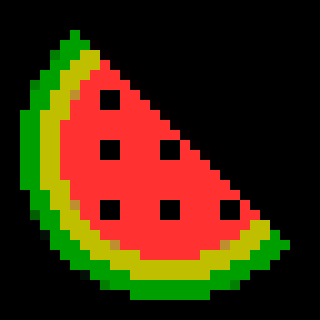
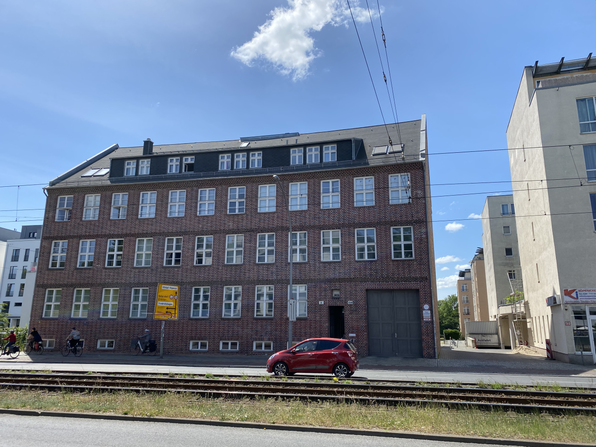
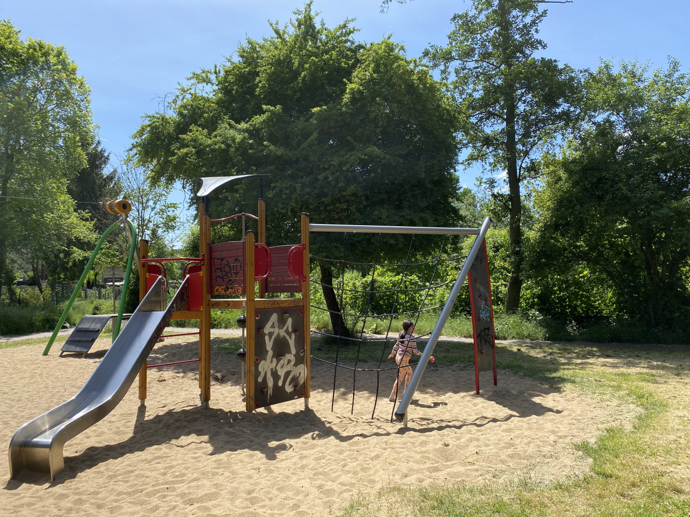

# GORK

[](https://codecov.io/gh/gkmngrgn/gork)

I derived the name from Zork that is a first text-based adventure game.

```shell
pip install -r requirements.txt
python -m gork.cli --help

# colors, texts, recognitions, etc
python -m gork.cli analyze --input=./files/park.png \
                           --output=./files/park_report.txt \
                           --ignore-cache

# default width, terminal width scale it by height.
python -m gork.cli print --width=80 \
                         --input=./files/park.png \
                         --ignore-cache

# default pixel size is 10.
python -m gork.cli export ./files/park.png \
                          ./files/park_output.png \
                          --pixel-size=15 \
                          --ignore-cache
```

| Original                             | Pixelated                                   |
|--------------------------------------|---------------------------------------------|
|  |  |
|         |         |
|    |    |
|            |            |
|                |                |

The terminal output:

[](https://asciinema.org/a/284169)

The base calculation code is from [pixelator][1] project. Also [img_term][2] app
helped me to display the image in the terminal.

# Contributing

```shell
pip install -r requirements-dev.txt
pytest
```

[1]: https://github.com/connor-makowski/pixelator
[2]: https://github.com/JonnoFTW/img_term
